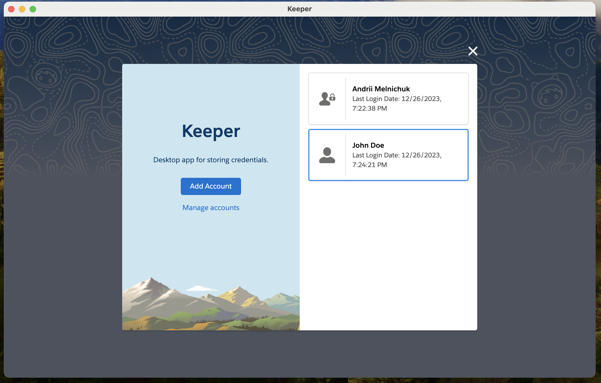
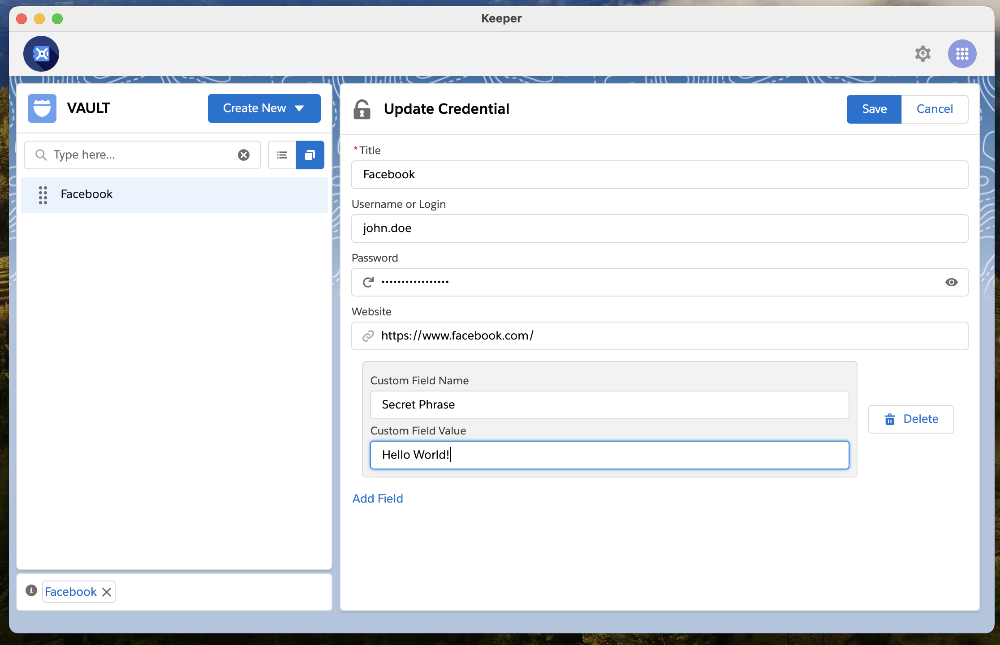

## Keeper


Desktop application supporting encryption for user-defined credentials 🔐

| Welcome Window                                | Credential Form                                |
|-----------------------------------------------|------------------------------------------------|
|  |  |

### How to build executable?

Install `node` version specified in `package.json` file. It's recommended to
use [NVM](https://tecadmin.net/install-nvm-macos-with-homebrew/) in order to manage NODE versions on local machine.

Make sure that [Python 2.7.18](https://www.python.org/downloads/release/python-2718) is downloaded and installed too.

Invoke the script below in order to generate executable:

```
npm install && npm run electron-pack
```

Note that the executable generation might take 5-10 minutes to complete!

#### Technical stack

`electron` `nodejs` `react` `js` `slds` `jest` `yarn` `npm` `bcrypt` `crypt` `react-dnd`

#### Resources used

- [Salesforce Lightning Design System](https://www.lightningdesignsystem.com)
- [Lightning Design System for React](https://react.lightningdesignsystem.com)
- [Building a production electron application](https://medium.com/@johndyer24/building-a-production-electron-create-react-app-application-with-shared-code-using-electron-builder-c1f70f0e2649)
- [State management with React Hooks](https://medium.com/javascript-in-plain-english/state-management-with-react-hooks-no-redux-or-context-api-8b3035ceecf8)
- [LowDB - small JSON database for Electron](https://www.npmjs.com/package/lowdb)
- [Windows Bash - Add 'Rsync'](https://blog.tiger-workshop.com/add-rsync-to-git-bash-for-windows)
- [React DnD](https://react-dnd.github.io/react-dnd/about)